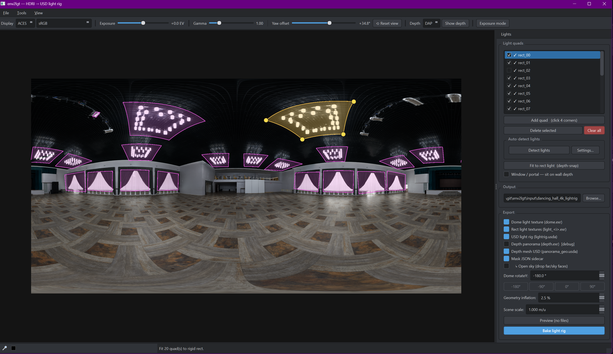
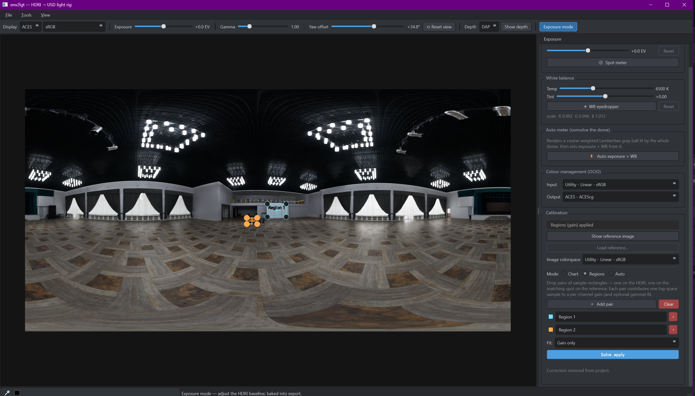
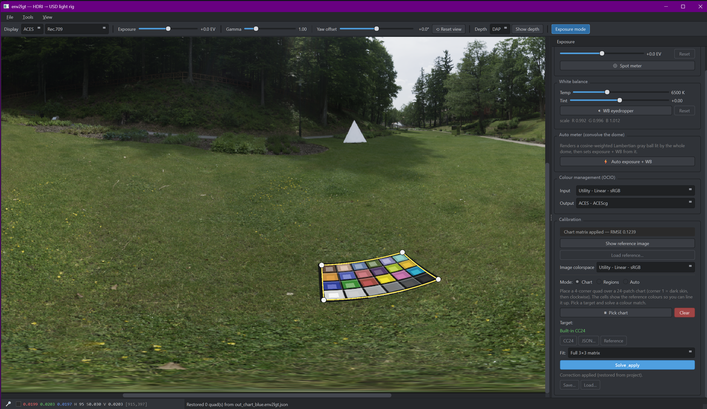

# env2lgt

**Convert a single equirectangular HDRI into a physically-positioned USD light rig — with full OCIO colour management and three modes of reference-image colour matching.**

Built for VFX lighting pipelines: take an HDRI latlong EXR, mark the practical lights with 4 clicks each, and bake out a USD scene containing a `UsdLuxDomeLight` for the environment, one `UsdLuxRectLight` per marked light positioned in world space via monocular panorama depth (DA² or DAP — see [Depth backends](#depth-backends)), and a depth-displaced `UsdGeomMesh` of the scene for validation. Drop the result into Karma, RenderMan, Storm, or any other USD-aware renderer.

Colour calibration against a reference photo is first-class: pick a 24-patch X-Rite **Chart**, drop paired **Region** sample rectangles on the HDR and the reference, or hit **Auto** for an NLE-style whole-image match. Every correction bakes into the exported textures so the rig ships colour-accurate.

> Released under **Apache-2.0** in good faith for the wider VFX community.
> Author / maintainer: **Maung Maung Hla Win** &lt;mexxmillion@gmail.com&gt;.
> If this tool helps your work, attribution is appreciated.



> *Light-rig mode: HDRI loaded, light quads drawn over the ceiling fixtures (auto-detect proposed the small ones, one large hand-placed quad highlights the selected fixture). The toolbar carries the OCIO display, viewport exposure / gamma / yaw, depth and exposure-mode controls; the right dock has the quad outliner, auto-detect settings, output path, and per-rig export options.*

| Exposure mode — Regions | Exposure mode — CC24 chart |
|---|---|
|  |  |
| *Paired sample rectangles on HDR + reference (whichever view is showing). Outliner row per pair with a colour swatch, name, and per-pair RMSE. Solver fits per-channel gain or gain + gamma.* | *24-patch CC24 chart placed on a real X-Rite target visible in the HDR. Cells show the reference colours overlaid for alignment — drag the white corner handles to refine. Fit modes: exposure, white-balance, or full 3×3 matrix.* |

<!--
GitHub's README renderer only inlines <video> tags whose src is an absolute
github.com URL (relative paths get stripped). The raw.githubusercontent.com
URL below resolves to the same blob committed at docs/demo.mp4.
-->

https://github.com/mexxmillion/env2lgt/raw/main/docs/demo.mp4

*Workflow demo (16 MB) — load EXR, click corners, bake, open in usdview. If your viewer doesn't inline the player, [download / open in a tab](docs/demo.mp4).*

> **Status:** working tool, not feature-complete. End-to-end pipeline is solid; UX still being iterated on.

---

## Features

- **OpenUSD-native, renderer-portable output** — Every bake authors plain ASCII `.usda` stages on top of `UsdLuxDomeLight` + `UsdLuxRectLight` + `UsdGeomMesh`. No proprietary scene format, no DCC plugin needed: drop the result into Houdini / Karma, Maya / Arnold, V-Ray, Redshift, RenderMan, Katana, Blender (via the USD bridge), Unreal Engine, NVIDIA Omniverse, or `usdview` itself. A composed `scene.usda` sublayers the light rig over the depth mesh so one file loads both at once; the individual layers stay separable for pipelines that want to compose them differently.
- **3D geometry estimation from depth** — A monocular panorama depth model lifts the equirectangular HDRI into 3D: every pixel gets a distance, so the room's surfaces — and the lights on them — sit at real world-space positions. The estimate can be exported as a depth-displaced mesh for validation in `usdview`.
- **Area-light extraction & placement from geometry** — Each marked light becomes a `UsdLuxRectLight`, sized, oriented and positioned from the estimated geometry (fit to the fixture's plane and depth), with a rectilinear texture sampled straight off the panorama so it maps 1:1 onto the light surface.
- **Rigid (no-shear) rect-light fit** — A "Fit to rect light" button depth-snaps every drawn quad to a *true* rectangle on its surface plane: orthogonal axes, no affine shear in the transform. Critical for renderers that decompose the USD xform into TRS (Arnold, V-Ray, Redshift, RenderMan, Karma, Maya/Max area lights) — they all silently drop shear, so anything authored as a parallelogram lands wrong. See [Rigid rect-light fitting](#rigid-rect-light-fitting).
- **Auto-detect lights** — One pass thresholds the panorama's bright sources into proposed quads — seam-aware, with angular merging of clustered fixtures and a tunable settings window. Detected quads are fit in a tangent-plane projection so their corners hug a fixture's true edges. Hand-placement (4 clicks + draggable corner handles) is always available too.
- **Dome light with Gaussian fill** — The environment is preserved as a `UsdLuxDomeLight`. The regions taken by the extracted area lights are cut out and seamlessly closed by an iterative, HDR-safe Gaussian edge-extend (Nuke `EdgeExtend`-style) — no dark holes, no rainbow inpaint artefacts.
- **OCIO display & ACEScg colour pipeline** — Everything is processed in a scene-linear ACEScg working space, with OCIO input/output transforms on the source and baked EXRs and a Nuke/Maya-style display + view transform for the viewport.
- **Reference-image colour matching, three ways:**
  - **Chart** — place a 24-patch ColorChecker quad on the HDR and solve an exposure / white-balance / full 3×3 correction against the built-in CC24, a JSON target, or a chart placed on a loaded reference photo. Saves to JSON for batch-matching a whole shoot.
  - **Regions** — drop persistent paired sample rectangles on the HDR and the reference photo (drag corners + centre `+` handle, named outliner row, per-pair RMSE). Solver fits per-channel **gain** or **gain + gamma** in log-space, with an automatic fall-back to gain-only when the gamma fit is underdetermined.
  - **Auto** — NLE-style "match colour" with no manual picking. Per-channel match using percentile anchors with 99th-percentile clipping so suns and lamps in the HDR don't poison the gains.
- **Auto exposure via dome integration** — A light-integration meter "convolves the dome": it renders a cosine-weighted Lambertian grey ball lit by the entire panorama and back-solves a baseline exposure + white balance from it. Spot-metering a dragged rectangle is also available.
- **Multiple depth backends** — Two panorama depth models behind one interface: **DAP** — Depth Any Panorama (metric, the default) — and **DA²** — Depth Anything in Any Direction (scale-invariant). Switch per-bake from the toolbar.
- **Display helpers** — Viewport display exposure, gamma, a Nuke-style pixel + area-average colour probe, and a turbo-mapped depth preview. All display-only — none of it touches the bake.
- **Project save / restore** — The whole session — quads, exposure/WB, colour-checker correction, scene scale, depth backend, output paths — round-trips through a JSON project file, and every bake autosaves one beside the source EXR.

---

## What it does

VFX lighting work often starts with an HDRI captured on set or generated from a CG scene. To use those panoramas as **practical lighting** in a render — i.e., lights that actually exist in 3D space and cast shadows correctly — you need three things:

1. **The bright sources isolated** so a renderer can sample them at high resolution (a dome light alone undersamples small bright sources, producing noisy specular reflections).
2. **Each source positioned in world space** so it occludes correctly behind walls / props.
3. **The rest of the environment** preserved as a dome / IBL so global indirect bounce still matches the captured scene.

env2lgt does all three with one tool, in minutes, for a single HDRI. The user's only manual work is clicking 4 corners around each practical light on the equirect panorama. Everything else — depth estimation, world-space placement, light texture extraction, dome inpainting, USD authoring — is automatic.

### Inputs

- **One** equirectangular `.exr` panorama (any resolution; 2K–8K tested).
- Optionally: a scene-scale value (meters per DA-2 unit) and a yaw-offset for seam-straddling lights.

### Outputs

For each bake, in a user-chosen output directory:

| File | Purpose |
|---|---|
| `lightrig.usda` | Composed scene: `UsdLuxDomeLight` (with `dome.exr` texture) + N × `UsdLuxRectLight` with per-light textures, sized + positioned in world space. |
| `dome.exr` | Original panorama with the marked light regions removed and **edge-extended** so the dome integrates cleanly with no dark holes. |
| `<lightname>.exr` | Per-light **rectilinear** texture sampled from the panorama through the quad surface. Maps 1:1 onto its `UsdLuxRectLight`. |
| `panorama_geo.usda` *(optional)* | Depth-displaced `UsdGeomMesh` sphere with the dome texture as `emissiveColor` — used to validate the depth + light placement visually in `usdview`. |
| `*.distance.exr` | DA-2 depth map cache (next to source EXR or in `.env2lgt_cache/`). Reused across bakes of the same HDRI. |
| `masks.json` | Sidecar with the 4 spherical corners of each quad + the yaw offset and scene scale at bake time. Lets you re-author future bakes deterministically. |

---

## GUI tour

Refer to the screenshot above.

### Toolbar (top)

Left to right:

- **Display** / **View** — OCIO display + view transform for the viewport (Nuke/Maya-style), driven by the `$OCIO` config. Display-only; see [Colour management](#colour-management).
- **Exposure** — log2 stops, display-only viewport exposure. Doesn't affect what's written (for a *baked* exposure shift, see [Exposure mode](#exposure-mode)).
- **Gamma** — display-only viewport gamma (`0.25 .. 4.0`). A look knob for the viewport only; never baked.
- **Yaw offset** — rolls the displayed panorama horizontally (in degrees). Use this to place lights that straddle the seam at u=0/u=W. Quad data stays in **absolute** spherical coords, so changing the offset doesn't move the lights — it only changes what's under the mouse.
- **⟲ Reset view** — zeroes the viewport exposure, gamma and yaw offset and refits zoom/pan.
- **Depth** — backend dropdown (DAP / DA²). Switching it snaps the Export panel's Scene scale to that backend's default (DAP → 1.0 m/u, DA² → 100).
- **Show depth** (hotkey **D**) — toggle the equirect view between HDR and a turbo-colormap of the distance map. Quad outlines + handles render on top either way, so you can verify each quad sits on a region of consistent depth before baking. First press runs depth in a background thread; subsequent toggles are instant.
- **Exposure mode** (hotkey **E**) — baseline exposure / white balance / colour-checker matching. See [Exposure mode](#exposure-mode).

(Scene scale moved off the toolbar — it now lives in the [Export panel](#export-panel) next to Geometry inflation.)

### Menus

- **File** — Open EXR, **Open Recent** (the last 10 EXRs, remembered across sessions), Save / Open Project.
- **Tools** — quad add/delete, Exposure mode, and **Open last bake in usdview** → *Light rig* / *Depth mesh* / *Light rig + depth mesh (layered)*.

### Status bar

Flush bottom-left: a Nuke-style pixel probe — colour swatch + scene-linear RGB/HSV under the cursor — plus an **eyedropper** button: drag a rectangle to read the average RGB of an area.

### Light quads panel (right)

- **List** of all defined quads. Double-click to rename — input is sanitized to USD/Maya/Houdini-friendly identifiers (`spaces → _`, non-`[A-Za-z0-9_]` stripped, no leading digits).
- **Add quad (click 4 corners)** — hotkey **A**. Enters add mode: cursor becomes a crosshair, four left-clicks place the four corners of a new quad. The 4 corners are auto-sorted CCW so click order doesn't matter. The newly-committed quad is selected and gets draggable vertex handles.
- **Delete selected** — hotkey **Delete**.
- **Auto-detect lights** — **Detect lights** thresholds the panorama's bright sources into proposed quads in one pass (locked quads are preserved; unlocked auto-proposals are regenerated). **Settings…** opens a separate window with the detection knobs — brightness threshold, blur, max count, min size, merge distance, floor-reflection suppression, and a live key-mask overlay. Detection runs on the baseline-adjusted HDRI, so it matches what you see and what the bake extracts.
- **Fit to rect light  (depth-snap)** — Pushes every unfitted quad through the depth-based rigid-rectangle fit (see [Rigid rect-light fitting](#rigid-rect-light-fitting)). First press blocks while depth is estimated (10–30 s); subsequent presses are instant. Fitted quads get a magenta 3-pt outline and a leading ✓ in the list. Dragging any corner of a fitted quad drops the ✓ — re-press to refresh just the touched ones.
- **Window / portal** — per-quad checkbox. Normally the rect light is slid in from the quad corners' (wall) depth to the bright region's depth, so it sits on the actual light rather than the wall behind it. Tick this for windows / skylights, where the bright pixels are distant sky through the opening — the rect then stays on the wall plane (flush, portal-friendly).

### Output panel

- **Output path** — pre-populated to `<exr_dir>/<exr_stem>_lightrig/` on every EXR load; editable; **Browse…** for a folder picker. The bake will create the directory if it doesn't exist, and warn before overwriting existing `lightrig.usda` / `dome.exr` / `rect_*.exr`.

### Export panel

Per-file output checkboxes. All are independent, so you can bake just the dome, just the rect textures, or any subset:

- `dome.exr` — the inpainted dome panorama
- `light_<i>.exr` — per-rect rectilinear textures
- `lightrig.usda` — the composed light scene
- `depth.exr` (debug) — write the raw distance map as a 3-channel EXR
- `panorama_geo.usda` — the depth-displaced UV sphere mesh
- `masks.json` — the mask sidecar

Plus two bake parameters: **Dome rotateY** (azimuth compensation for the target renderer), **Geometry inflation** (push the depth mesh outward so it doesn't z-fight the rect lights), and **Scene scale** — metres per scene unit, moved here from the toolbar. DAP depth is metric so it defaults to 1.0; DA² is scale-invariant and wants ≈100.

### Preview vs Bake

- **Preview (no files)** — runs the full pipeline with every `write_*` set to False. Produces an in-memory table of per-quad fit results (center, size, normal, intensity, RANSAC inlier ratio). Useful for sanity-checking before committing files to disk. Distance cache lands at `<exr_dir>/.env2lgt_cache/` so the first real bake hits it for free.
- **Bake light rig** — full pipeline, writes everything checked.

---

## Exposure mode

Press **E** (or the toolbar button / *Tools → Exposure mode*) to enter exposure mode. The right dock swaps to the exposure panel and the light quads hide. Everything here shifts the **HDRI baseline** — unlike the toolbar Exposure slider, these adjustments are **baked into the exported dome / rect textures and light intensities**.

- **Exposure offset** — a baseline shift in stops.
- **Spot meter** — drag a rectangle; its average is metered to 18% middle grey, setting the exposure offset (camera spot-meter behaviour).
- **White balance** — Lightroom-style **Temperature** + **Tint** sliders. The **WB eyedropper** samples a rectangle over something neutral and back-solves the sliders.
- **Auto exposure + WB** — "convolve the dome": renders a cosine-weighted Lambertian gray ball lit by the whole panorama and sets exposure + WB from it.

### Reference colour matching

Three workflows for matching an HDRI to a known chart or a reference plate. They live under the **Calibration** group in the exposure panel and share a single "active correction" pill at the top so you always know which sub-mode is driving the displayed image. All three feed into the same apply path (preview + bake), so flipping between modes is non-destructive — each keeps its own state until you press *Clear*.

All three operate **after** the OCIO input transform, in the scene-linear working space. Load a reference photo with *Load reference…* (8-bit images auto-tagged as sRGB, EXR/HDR through OpenImageIO, override the colorspace from the panel if the auto-detect is wrong).

#### Chart — 24-patch ColorChecker

Match an HDRI to a known chart or a reference plate (MMColorTarget-style):

1. **Pick chart** — click the 4 corners of a 24-patch ColorChecker on the panorama (dark-skin patch first, then clockwise). The overlay curves along the equirect projection and fills each cell with the reference colour so you can line it up by eye; drag the handles to refine.
2. **Target** — the built-in **CC24** reference, a custom 24-swatch **JSON** target, or a **Reference** photo: place a flat chart on the loaded reference image and match against it.
3. **Fit** — exposure-only, white-balance, or a full **3×3 matrix**, solved by least squares. The RMSE is reported; the correction bakes into the rig. A guard refuses to apply if the fit is obviously degenerate (low sample variance, runaway matrix entries, or RMSE above a sane threshold) — chart-on-grass user error gets caught instead of nuking the panorama.
4. **Save / load correction** — export the solved correction (matrix + fit mode + target) to JSON and reload it on other HDRIs. Solve once, batch-match every panorama from the same shoot without re-placing a chart.

#### Regions — paired sample rectangles

When the HDRI **doesn't contain a physical chart** but you still have a reference photo of the same scene (or any matching object — a wall colour, a car panel), drop **paired sample rectangles** instead. Common case: on-set bracketed photo for grade reference vs. an HDRI captured an hour later.

1. **Add pair** — drops a centred rectangle on **both** views (HDR and reference) using the current yaw as the anchor. Each pair gets a colour from a cycling palette, a numbered/named row in the outliner, and a per-pair RMSE column after solving.
2. **Refine** — every rect has 4 corner handles **and** a centre `+` handle for body-drag. Move them so each pair points at the *same physical surface* in both images (a flat-painted wall, a car panel, a uniform piece of carpet). The HDR rects are stored in **absolute** UV so they follow the panorama when you scrub the yaw slider; you can roll yaw to bring a region of interest into view before placing.
3. **Solve** — per-channel **gain** (one scalar per channel, the honest default for properly-IDT'd linear data) or **gain + gamma** (fits `log(ref) = log(gain) + γ · log(hdr)` per channel by least squares — opt in when "linear" isn't really linear, e.g. a JPEG mis-tagged as sRGB or a tone-curve baked into the HDR).
4. **Robustness** — the solver auto-falls-back to gain-only when the gamma fit would be underdetermined (n < 3 pairs, or pairs too clustered in log-luma to identify the slope). The effective fit mode + a one-line note are surfaced in the status so you know what actually happened.
5. **Outliner selection** — drag-marquee a region in the viewport and the outliner row ticks. Press **Delete** to remove. Selection round-trips both ways.

Best practice: pick 3+ pairs of dissimilar luminance (one dark surface, one mid, one bright). Avoid speculars, edges, and saturated colours (the model is a per-channel gain; cross-channel mixing isn't captured). The "Active correction" pill reports `Regions (gain) applied — RMSE 0.0042` etc.

#### Auto — NLE-style whole-image match

When you want a fast "make the HDRI look like the reference" with no manual picking, hit **⚡ Auto match**. Inspired by Avid / Final Cut "match colour" and Resolve's auto-grade.

The algorithm, per channel, in linear working space:

1. **Clip the HDR at the 99th percentile.** Suns, lamps, and other bright outliers wildly skew global statistics — the percentile clamp keeps them from poisoning the gains.
2. **Take two anchor quantiles** in each image — `Q25` and `Q50`.
3. **Fit** in *gain* mode: `gain = ref_Q50 / hdr_Q50`. Or in *gain + gamma* mode: `gamma = log(ref_Q50/ref_Q25) / log(hdr_Q50/hdr_Q25)`, then `gain = ref_Q50 / hdr_Q50 ** gamma`.

The output feeds the same `apply_gain_gamma` pipeline as Regions, so preview and bake just work.

When to use which:

| Situation                                          | Best mode |
|----------------------------------------------------|-----------|
| Physical CC24 in the HDRI                          | **Chart** |
| Reference photo of the same scene, no chart        | **Regions** |
| Wildly different framing in HDR vs reference       | **Auto**  |
| Quick first-pass grade match                       | **Auto**  |
| Precise colour-managed delivery                    | Chart > Regions > Auto |
| HDR with practicals already burned into the dome   | Regions (avoid sampling those areas) |

> Note on linear-pipeline honesty: **gain only is the right default** in a properly OCIO-managed scene-linear flow. The only physically meaningful difference between two correctly-IDT'd linear captures is a per-channel scalar (exposure + white-balance drift). Gamma is a non-linearity fudge knob — useful when something upstream isn't actually linear (mis-tagged JPEG, log curve, baked tone-curve), but if you've done the colour management correctly the recovered gammas should land near 1.0.

### Colour management

env2lgt works internally in a scene-linear **working space** (the `$OCIO` config's `scene_linear` role — ACEScg in an ACES config):

- **Input transform** — the source EXR's colorspace, converted to working on load (Exposure panel → *Colour management*). Defaults to ACEScg; pick `Utility - Linear - sRGB` for an sRGB-linear source, etc.
- **Output transform** — the colorspace the baked dome / rect EXRs are written in.
- **Reference image colorspace** — a separate input transform for a loaded colour-chart reference photo (auto-detected as sRGB for 8-bit images; override in the colour-checker panel).
- **Display / View** — the viewport transform (toolbar dropdowns).

If `$OCIO` is unset or PyOpenColorIO is unavailable, the app falls back to a fixed ACES-filmic display and the colour-management controls are disabled.

---

## Rigid rect-light fitting

`UsdLuxRectLight` is a rectangle. The USD spec lets you put *any* `transform` on it, including one with affine shear, and Hydra/Storm will faithfully render that as a sheared parallelogram. **Every other consumer drops the shear.** When a downstream tool reads the USD prim it TRS-decomposes the transform and authors a width × height rectangle with whatever the rotation component came out as — the shear vanishes silently and the light lands in the wrong place at the wrong orientation. So a free-form 4-corner quad authored as a sheared `UsdLuxRectLight` is *non-portable*. Anywhere except usdview / Storm, it ships wrong.

env2lgt fixes this with the **"Fit to rect light"** button. After drawing quads the usual way (4 clicks, drag handles to refine), one press snaps every quad to a true rectangle:

1. **Depth estimate.** First press fires the depth backend (10–30 s for DA² / DAP) and caches the result. Subsequent presses are instant.
2. **Plane fit on the bright sub-region.** The quad's mask is rasterised on the panorama; bright pixels' depths are lifted to 3D and a RANSAC plane is fit. This is the light's *surface* plane — not the wall behind it, and not biased by corners the user dragged out past the fixture edges. Falls back to per-corner depths when the bright region is too small / low-contrast.
3. **Project corner rays onto the plane.** Each of the 4 user-placed corner directions is intersected with the plane, giving 4 in-plane points.
4. **Recover rotation via diagonal-bisector.** The rectangle's u-axis is the average direction of opposite edges (equivalently: the angle bisector of the diagonals). We don't use PCA — it has degenerate eigenvalues on near-square inputs and silently picks an arbitrary basis ~45° off the rect's true edges. The bisector method uses edge directions explicitly and stays robust on squares.
5. **Orthonormal frame + bbox.** With `(u, v, n)` orthonormal by construction, the bbox of the 4 projected points in `(u, v)` gives width × height. The 4 rigid corners are emitted as `center ± (w/2)·u ± (h/2)·v` and lifted back to unit dirs for the viewer to display.

The viewer shows the snapped corners with a magenta 3-pt outline and a leading ✓ in the panel list. **What you see is what the bake authors** — same algorithm in both, so there's no viewer/bake drift. Dragging any corner of a fitted quad flips the flag back to *unfitted* (outline reverts to cyan/orange/green) so a re-press is obviously needed.

### Why this matters — DCC / renderer support for shear

| Tool | Rect-light representation | Honors shear in xform? |
|---|---|---|
| **USD `UsdLuxRectLight`** (Hydra/Storm) | width + height + 4×4 transform | Yes (rare; spec-correct) |
| **Arnold** (`quad_light` via MtoA / HtoA / KtoA) | width × height + xform | No — TRS-decomposed |
| **V-Ray** (`VRayLightRectangle`) | u_size × v_size + xform | No — no shear input in the SDK |
| **Redshift** (`RSPhysicalLight`, area) | width × height + xform | No |
| **RenderMan** (`PxrRectLight`) | width × height + xform | No |
| **Karma / Houdini LOPs** | width / height attrs + xform | No — TRS UI on the prim |
| **Maya area lights** (`aiAreaLight`, `VRayLightRect`, `RedshiftPhysicalLight`) | width / height + node TRS | No |
| **3ds Max** (V-Ray Light Plane, Standard area) | length × width + node TRS | No |
| **Nuke** (3D ReLight / ScanlineRender) | size + axes | No |

Authoring rigid rectangles is the only portable form. env2lgt's bake produces rigid output regardless of whether you press the fit button (`_fit_from_4points` in `lights/extract.py` always returns orthonormal axes now) — the button is purely about **previewing** the same result on the panorama before you commit.

### Limitations

- **Plane fit needs bright contrast.** On a low-contrast fixture (e.g. a frosted ceiling tile against an off-white ceiling), the bright-region RANSAC can fall back to per-corner depths, which is noisier. Check via *Show depth* (**D**) that each quad sits on a region of plausible, consistent depth before pressing Fit.
- **Depth quality bounds fit quality.** DA² and DAP are good but not exact. If the depth wobble around a fixture is large compared to the fixture size, the fitted plane may tilt slightly.
- **Wide-angle quads.** Quads spanning > 90° of the sphere stress the gnomonic projection and the plane fit; the snap stays orthonormal but width × height accuracy drops at the edges.

---

## Architecture

```
┌────────────────────────────────────────────────────────────────────┐
│  env2lgt   (conda env, python 3.11)                                │
│  ├─ PySide6 6.10                       UI                          │
│  ├─ OpenUSD 26.03 (with usdview)       authoring                   │
│  ├─ OpenEXR 3.4 / OIIO 3.1             EXR I/O                     │
│  ├─ OpenCV 4.13                        image ops                   │
│  └─ numpy / scipy                                                  │
│                                                                    │
│        │   JSON over stdin/stdout (one daemon per backend)          │
│        ▼                                                            │
│  ┌──────────────────────────────┐  ┌──────────────────────────────┐ │
│  │ env2lgt-da2  (py 3.12)       │  │ env2lgt-dap  (py 3.12)       │ │
│  │ ├─ torch 2.5 + CUDA 12.4     │  │ ├─ torch 2.7.1 + CUDA 12.8   │ │
│  │ ├─ xformers + triton-windows │  │ └─ DAP (DINOv3, metric)      │ │
│  │ └─ DA-2 (scale-invariant)    │  │                              │ │
│  └──────────────────────────────┘  └──────────────────────────────┘ │
└──────────────────────────────────────────────────────────────────────┘
```

**Why separate envs?** DA-2 pins `torch==2.5.0 + cu124 + xformers==0.0.28.post2` and DAP wants `torch==2.7.1`; neither is compatible with the other, nor with what the openusd / pyside6 UI stack wants. Each depth backend gets its own cleanly pip-resolvable conda env, and the UI releases independently of the depth models. The UI talks to a long-lived worker (one per backend, spawned on first use) over line-delimited JSON; cold start is ~12 s for DA-2 / ~6 s for DAP, and every subsequent bake on the same EXR hits the file-hash distance cache and runs in ~1 s.

---

## Depth backends

The depth model sits behind a `DepthBackend` protocol ([env2lgt/depth/base.py](env2lgt/depth/base.py)), so it's a config switch rather than a hard dependency. Two backends are available:

| | **DA²** (`da2`) | **DAP** (`dap`) |
|---|---|---|
| Repo | [EnVision-Research/DA-2](https://github.com/EnVision-Research/DA-2) | [Insta360-Research-Team/DAP](https://github.com/Insta360-Research-Team/DAP) |
| License | Apache-2.0 | MIT |
| Backbone | SphereViT | DINOv3-Large (Meta) |
| Depth output | scale-invariant (relative) | **metric** (meters) |
| `scene_scale` role | primary meters-per-unit knob | fine-tune multiplier (default 1.0) |
| Conda env | `env2lgt-da2` | `env2lgt-dap` |

**Selecting a backend** — three ways, in precedence order:

1. The **Depth** dropdown in the toolbar (per-bake, no restart).
2. The `depth_backend` key saved in the project file (`*.env2lgt.json`).
3. The `ENV2LGT_DEPTH_BACKEND` environment variable (`da2` | `dap`), default `dap`.

When a metric backend is selected, `bake.py` records `is_metric` + `depth_backend` in `masks.json` and the `scene_scale` slider becomes a fine-tune multiplier rather than the primary scale control.

> **DAP status:** wired and **validated**. The `env2lgt-dap` env + weights are in place; the full registry → daemon → inference path produces a metric depth EXR end-to-end (~0.8 s on a 3090). An A/B against DA² over 6 HDRIs shows ρ = 0.85–0.99 structural agreement, and DAP's metric output is consistent across similar-scale scenes (room-scale HDRIs cluster at ~1.7–2.2 m median). The one thing still unconfirmed is absolute calibration against a scene of *known* dimensions. Full results in [docs/DAP_BACKEND_PLAN.md](docs/DAP_BACKEND_PLAN.md).

---

## Install

### Prerequisites

- Windows 10/11 x64 (Linux untested but should work — replace path separators)
- NVIDIA GPU (RTX 3090-class, ≥ 24 GB VRAM recommended; smaller works but DA-2 has to downscale)
- conda (miniconda or miniforge)
- Disk: ~15 GB on `E:` for the two envs + DA-2 model weights cache
- An **OCIO config** for colour management — set the `OCIO` environment variable to a `config.ocio` (e.g. an [ACES config](https://github.com/AcademySoftwareFoundation/OpenColorIO-Config-ACES)). Optional: without it the app falls back to a fixed ACES-filmic display. `PyOpenColorIO` itself ships with the conda `opencolorio` package (already in `environment.yml`).

### Setup

The environments are defined in **`environment.yml`** (UI) and
**`environment-da2.yml`** (depth). Pip extras are pinned in
**`requirements.txt`** and **`requirements-da2.txt`**.

Both YAML files declare a `name:`, so the commands below create the conda
envs `env2lgt` and `env2lgt-da2` in your default conda location — no `E:`
drive required. (If you prefer a specific location, add `-p <path>` to
`conda env create` and substitute that path for the `-n <name>` flags below.)

```cmd
:: ─── 1. UI / USD / EXR environment ───────────────────────────────
conda env create -f environment.yml
conda activate env2lgt
pip install -e .                                   :: registers `env2lgt` and `env2lgt-bake`

:: ─── 2. DA-2 inference environment ──────────────────────────────
conda env create -f environment-da2.yml

:: torch + xformers from the CUDA 12.4 index (the version DA-2 pins)
conda run -n env2lgt-da2 pip install ^
    --index-url https://download.pytorch.org/whl/cu124 ^
    torch==2.5.0 torchvision==0.20.0 torchaudio==2.5.0 xformers==0.0.28.post2

:: DA-2 itself (resolves the rest of its pinned tree).
:: Clone anywhere you like, then point ENV2LGT_DA2_REPO at it (see below).
git clone https://github.com/EnVision-Research/DA-2
conda run -n env2lgt-da2 pip install -e DA-2\src

:: triton + OpenEXR extras we add on top
conda run -n env2lgt-da2 pip install -r requirements-da2.txt

:: ─── 3. DAP inference environment (optional) ─────────────────────
:: Only needed to use the `dap` depth backend. DAP pins a newer torch
:: than DA-2, so it gets its own env. Verified with torch 2.7.1 + cu128.
conda env create -f environment-dap.yml
conda run -n env2lgt-dap pip install ^
    --index-url https://download.pytorch.org/whl/cu128 ^
    torch==2.7.1 torchvision==0.22.1
:: Clone DAP anywhere, then point ENV2LGT_DAP_REPO at it (see below).
git clone https://github.com/Insta360-Research-Team/DAP
conda run -n env2lgt-dap pip install -r requirements-dap.txt

:: DAP weights — download model.pth from HuggingFace into a folder of
:: your choice, then point ENV2LGT_DAP_WEIGHTS at that folder.
::   https://huggingface.co/Insta360-Research/DAP-weights
```

If you want a flat `requirements.txt` workflow for the UI env (e.g., for CI),
note that you **still** need conda for `openusd`, `pyside6`, `py-openimageio`,
and `openexr` — these aren't shippable as pip wheels on Windows in 2026.
The `requirements.txt` only covers the pure-Python additions.

### Cache locations + DA-2 paths (one-time)

Set these once with `setx` (paths are examples — point them anywhere with room):

```cmd
setx OCIO                "C:\OCIO\aces_1.2\config.ocio"
setx HF_HOME             "D:\models\huggingface"
setx TORCH_HOME          "D:\models\torch"
setx HF_TOKEN            "hf_xxxxxxxxxxxxxxxxxxxxxx"
setx ENV2LGT_DA2_ENV     "<conda envs dir>\env2lgt-da2"
setx ENV2LGT_DA2_REPO    "<where you cloned DA-2>"
setx ENV2LGT_DAP_ENV     "<conda envs dir>\env2lgt-dap"
setx ENV2LGT_DAP_REPO    "<where you cloned DAP>"
setx ENV2LGT_DAP_WEIGHTS "<folder holding DAP model.pth>"
```

`ENV2LGT_*_ENV` / `ENV2LGT_*_REPO` tell each depth runner where its conda
env and repo live. If unset, the runners fall back to `E:\conda\envs\...`
and `E:\models\...` — so on any machine that isn't the original `E:`-drive
setup, **set these**. Run `conda info --base` to find your conda envs
directory. **`ENV2LGT_DAP_WEIGHTS`** must point at the folder holding DAP's
`model.pth` (no sensible default — the path baked into DAP's
`config/infer.yaml` is the authors' own machine). `ENV2LGT_DEPTH_BACKEND`
(`da2` | `dap`) picks the default backend; it defaults to `dap`.

### Run

```cmd
conda activate env2lgt
python -m env2lgt.app
```

Or the bundled launcher — edit the paths at the top of `launch.cmd` first:

```cmd
launch.cmd
```

---

## Pipeline (what happens when you click Bake)

1. **Load EXR** — `OpenImageIO` reads the latlong as float32 RGB.
2. **DA-2 inference** — IPC to the daemon. First time per EXR: ~150 ms of GPU work + ~2 s of file I/O and Python overhead. Cached as `<stem>.<hash>.distance.exr` and reused across bakes.
3. **For each quad**:
   - **Rasterize spherical quad** → `(H, W)` uint8 mask, via ray/plane intersection on every panorama pixel (handles seam-wrap and near-pole quads correctly, see [env2lgt/proj.py](env2lgt/proj.py)).
   - **Rect-light geometry** from quad corners × median mask depth: center, normal, u-axis, v-axis, width, height — all in world space ([env2lgt/lights/extract.py::rect_from_quad](env2lgt/lights/extract.py)).
   - **Color** = luminance-weighted mean of the masked region, normalized to max=1.
   - **Intensity** = sum of luminance × per-pixel solid angle over the mask.
   - **Texture** = `sample_rect_texture()`: rectilinear projection of the quad surface via `cv2.remap`, so the resulting EXR maps 1:1 onto a flat `UsdLuxRectLight`. Aspect-matched to the world-space rect, max 1024 on the long side.
4. **Dome residual** — union of all quad masks, then `edge_extend()` ([env2lgt/lights/inpaint.py](env2lgt/lights/inpaint.py)): iterative Gaussian push-fill in log-domain (Nuke `EdgeExtend` / Mocha PushPull style). Produces a smooth, HDR-safe fill — no rainbow noise like `cv2.INPAINT_TELEA` on bright values.
5. **USD authoring** — `lightrig.usda` with `/World/lights/dome` (DomeLight + 90° Y compensation for USD's azimuth convention) and `/World/lights/<name>` per quad.
6. **Optional mesh** — `panorama_geo.usda`: 256×128 UV sphere displaced radially by depth, with `dome.exr` bound as emissive texture through `UsdPreviewSurface` + `UsdUVTexture` + `UsdPrimvarReader_float2`. The mesh and the rect lights agree on world space, so any drift between dome and rect lights is a renderer convention issue, not pipeline math.

---

## Validation workflow

1. **Place quads** on the panorama.
2. **Press D** — flip to depth view. Confirm each quad sits on a region of plausible, consistent depth. Lights at very different depths than their immediate surroundings (e.g. a window with the sky visible through it) may need manual scale-tweaking later.
3. **Preview (no files)** — get the fit table. Sanity-check sizes (a wall sconce should be ~0.3 m, a ceiling panel ~1–2 m). If a quad reports a 50 m × 30 m fit, the depth under that mask is unreliable.
4. **Check Depth mesh USD**, **Bake**.
5. **Tools → Open last bake in usdview** → *Light rig + depth mesh (layered)*. The rect lights should sit directly on the bright fixtures in the dome texture; the panorama mesh shows them in 3D space.
6. **Adjust Scene scale** in the Export panel and re-bake if everything is too small / too big. Cache hit → ~1 s per re-bake.

---

## Repository layout

```
env2lgt/
├── app.py                   PySide6 entry point (MainWindow)
├── bake.py                  End-to-end pipeline orchestration
├── cli.py                   `env2lgt-bake` headless command (stub)
├── proj.py                  Sphere ↔ equirect ↔ rectilinear math (single source of truth)
├── color.py                 OCIO colour management (working space, transforms, display)
├── colorchecker.py          Colour-checker rectify / sample / least-squares solve
├── exposure.py              Exposure + white-balance metering (spot, dome convolution)
├── depth/
│   ├── base.py              DepthBackend protocol
│   ├── __init__.py          Backend registry — get_backend() / ENV2LGT_DEPTH_BACKEND
│   ├── da2_runner.py        DA-2 backend (scale-invariant) — persistent daemon manager
│   └── dap_runner.py        DAP backend (metric) — persistent daemon manager
├── io/
│   ├── exr.py               OIIO-based latlong load/save
│   └── tonemap.py           ACES + sRGB display tonemap, turbo depth colormap
├── lights/
│   ├── extract.py           sample_rect_texture, rect_from_quad, photometry
│   └── inpaint.py           Iterative gaussian edge-extend (HDR-safe)
├── ui/
│   ├── viewer.py            Equirect viewer + 4-click placement + drag handles + chart
│   ├── light_panel.py       Quad list, name sanitizer, export options, paths
│   └── exposure_panel.py    Exposure / white-balance / colour-checker / OCIO panel
└── usd/
    ├── lightrig.py          UsdLuxDomeLight + UsdLuxRectLight authoring
    └── mesh.py              Depth-displaced UV sphere with emissive dome
scripts/
├── da2_infer.py             Lives inside env2lgt-da2; one-shot OR --serve daemon mode
├── dap_infer.py             Lives inside env2lgt-dap; one-shot OR --serve daemon mode
└── batch_bake.py            Batch-bake every EXR in a directory (auto top-N brightness blobs)
```

---

## Limitations & known issues

- **Depth is relative.** DA-2 outputs scale-invariant distance. The scene-scale slider is the user's only mechanism to make it metric. There's no auto-estimation of absolute scale.
- **Plane fit assumes the fixture is genuinely planar in 3D.** A quad drawn around a curved fixture (recessed bowl, hanging globe) or a multi-window arrangement that spans separate surfaces will fit a single plane through the average, which may look wrong. The rigid rect-light fit (see [Rigid rect-light fitting](#rigid-rect-light-fitting)) makes the *transform* clean but can't recover geometry the depth estimate doesn't see.
- **Rectilinear texture works best for small angular extents.** Quads spanning > 90° in any direction will show distortion in the sampled rectangular texture (the bilinear-of-4-corners interpolation deviates from true rectilinear projection for wide quads).
- **`triton-windows` is required for the xformers fused-attention path.** Without it inference still works, just ~17 % slower.
- **Windows-only paths.** Forward-slash equivalents would be a small refactor in `da2_runner.py` and the launcher.

---

## Roadmap

- [x] **Swappable depth backend** — `DepthBackend` protocol + registry, DA²/DAP backends, UI dropdown, project-file key, DAP inference wired + validated against DA². See [Depth backends](#depth-backends) and [docs/DAP_BACKEND_PLAN.md](docs/DAP_BACKEND_PLAN.md). *Remaining:* absolute metric calibration against a known-size scene.
- [x] **Exposure mode** — baked baseline exposure offset, Lightroom-style white balance, spot + convolve-the-dome metering, OCIO colour management (ACEScg working space, input/output transforms, viewport display/view), and colour-checker chart matching (CC24 / JSON / reference-image targets, 3×3 least-squares fit). See [Exposure mode](#exposure-mode).
- [x] **Auto-detect lights** — proposes quads from brightness-thresholded, seam-aware connected components, with angular merging of clustered sources. Tunable from a dedicated settings window; quads are fit in a tangent-plane projection for correctly-oriented corners. See the [Light quads panel](#light-quads-panel-right).
- [ ] **Load masks.json** — reproduce a previous bake's quad layout for a new render.
- [ ] Disk + portal lights (in addition to rect).
- [ ] Per-quad intensity multiplier in the panel.
- [ ] Compose `lightrig.usda` + `panorama_geo.usda` into a single `validation.usda` reference.
- [ ] Drag-drop EXR file load (currently dependent on Windows OLE behaviour that doesn't play with `QGraphicsView`).
- [ ] Linux build of the conda envs.

---

## Acknowledgements

- **DA-2** — [EnVision-Research/DA-2](https://github.com/EnVision-Research/DA-2) ("Depth Anything in Any Direction", arXiv:2509.26618). The SOTA monocular panorama depth model this pipeline relies on. © Tencent Hunyuan / HKUST.
- **DAP** — [Insta360-Research-Team/DAP](https://github.com/Insta360-Research-Team/DAP) (CVPR 2026, arXiv:2512.16913). MIT-licensed metric panorama depth, DINOv3 backbone — the studio-approvable alternate backend.
- **OpenUSD** — Pixar / Apple / the OpenUSD community.
- **PySide6 / Qt6** — The Qt Company.
- **OpenImageIO / OpenEXR / OpenColorIO** — the VFX foundation libraries every pipeline is built on.
- **Nuke** — the inspiration for the dome `edge_extend` fill behaviour.

---

## License

env2lgt is licensed under the **Apache License 2.0** — see [LICENSE](LICENSE)
for the full text. This is the same license OpenUSD ships under, so the two
compose cleanly. You can use, modify, and redistribute the code, including
in commercial / closed-source pipelines, as long as you keep the copyright
and license notice.

### Author & attribution

env2lgt is written and maintained by **Maung Maung Hla Win**
(`mexxmillion@gmail.com`). It's released in good faith for the wider VFX
community — if you use it, ship something with it, or fork it for your
studio's pipeline, I'd appreciate keeping the author credit visible (the
SPDX header at the top of every source file, and / or a line in your
project credits). It helps future opportunities find me.

Pull requests welcome. For bugs, design suggestions, or pipeline
integration questions, open an issue at
[github.com/mexxmillion/env2lgt](https://github.com/mexxmillion/env2lgt/issues).

Third-party components retain their own licenses:

| Component | License |
|---|---|
| **OpenUSD** | Apache 2.0 |
| **OpenEXR / Imath / OIIO / OCIO** | BSD-3-Clause |
| **PySide6 / Qt6** | LGPL-3.0 (linking is fine; no redistribution of modified Qt here) |
| **OpenCV** | Apache 2.0 |
| **DA-2 (model + weights)** | See the [DA-2 repo](https://github.com/EnVision-Research/DA-2) — Tencent Hunyuan, weights have their own usage terms |
| **triton-windows** | MIT |

The DA-2 weights are downloaded at runtime from HuggingFace (`haodongli/DA-2`);
we don't redistribute them. Check Tencent's terms before commercial deployment.
